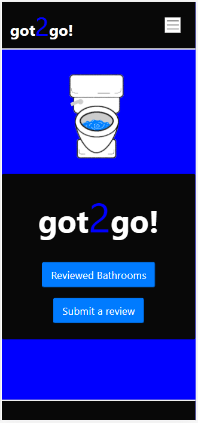
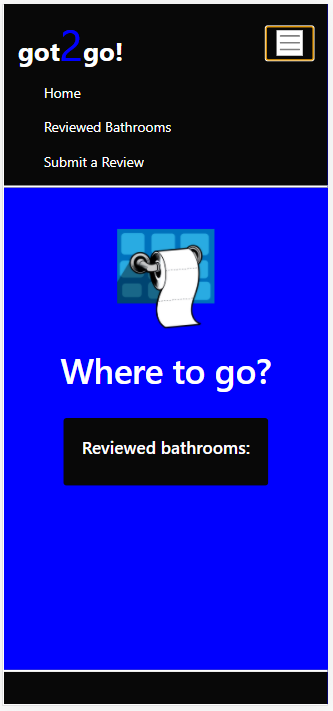
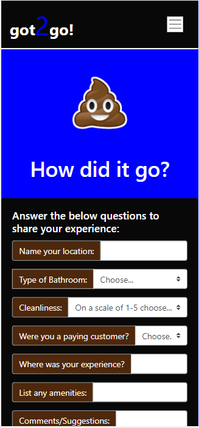

# got2go!


## Description

A user friendly application that allows the user to submit a review of a public bathroom. 

## Table of Contents 

* [Installation](#installation)

* [Usage](#usage)

* [License](#license)

* [Tests](#tests)

* [Links](#links)

* [Screenshots](#screenshots)

* [Creators](#creators)

* [Contributing](#contributing)

* [Questions](#questions)

## Installation

To install necessary dependencies, run the following command:

```
npm i
```

## Usage

* add
* cordova
* cordova-plugin-geolocation
* express
* mysql2
* plugin
* sequelize

## License

This project is licensed under the Unlicense license.

## Tests - N/A

## Links

* Github Repository - https://github.com/ElijahFlanders96/Project_2.git
* Heroku Deployment - https://arcane-stream-61363.herokuapp.com/

## Screenshots: Mobile-first view

### Home page


### Reviewed bathrooms page


### Submit review page


## Creators
* Casey Morgan - You can find more of my work at [cc22389](https://github.com/cc22389/)
* Elijah Flanders - You can find more of my work at [ElijahFlanders96](http://github.com/ElijahFlanders96/)
* Kylie Schmidt- You can find more of my work at [kyliemegan24](http://github.com/kyliemegan24/)
* Raymond Gordon - You can find more of my work at [rjgordon26](http://github.com/rjgordon26/)

## Contributing
* Gage Eide
* Dan Mueller
* Kieran Anthony

## Questions

If you have any questions about the repo, open an issue or contact any of the following directly at:
* caseyjeanmorgan@gmail.com. 
* elijahflanders15@gmail.com. 
* kyliemegan24@gmail.com. 
* rjgordon26@gmail.com. 

